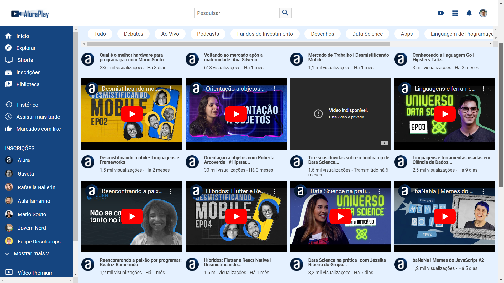

# Alura Play
O Projeto Alura Play é uma plataforma de ensino online que oferece uma variedade de cursos e conteúdos educacionais para quem deseja aprender e se aprimorar em diversas áreas do conhecimento. Com o Alura Play, você tem acesso a cursos práticos, desafios interativos e materiais complementares para impulsionar o seu aprendizado.

## Sobre o projeto
A plataforma Alura Play reúne uma equipe de instrutores especializados que desenvolvem conteúdos de alta qualidade, abrangendo desde tecnologia da informação até design e negócios. Com uma abordagem prática e focada no mercado de trabalho, o Alura Play permite que os usuários desenvolvam novas habilidades e estejam sempre atualizados com as últimas tendências em suas áreas de interesse.

## Recursos do Projeto:
- Diversidade de cursos em diversas áreas do conhecimento
- Aulas práticas e dinâmicas ministradas por profissionais experientes
- Exercícios e desafios para consolidar o aprendizado
- Recursos complementares, como apostilas e quizzes interativos

Com o Alura Play, você pode expandir seus conhecimentos, desenvolver novas habilidades e se preparar para os desafios do mercado de trabalho de forma eficaz. Explore nossos cursos e comece a investir no seu crescimento profissional hoje mesmo!

### 📦 Tecnologias usadas
* [HTML](https://developer.mozilla.org/pt-BR/docs/Web/HTML)
* [CSS](https://developer.mozilla.org/pt-BR/docs/Web/CSS)
* [JavaScript](https://developer.mozilla.org/pt-BR/docs/Web/JavaScript)

### 👷‍♂️ Autores / Colaboradores

* **Luan Alves** - *Instrutor Frontend do projeto* - [@luan-alvesdev](https://github.com/luan-alvesdev)

* **Arthur Cavalcante** - *Frontend do projeto* - [@Thurcavalcante](https://github.com/Thurcavalcante)

### 🔗 Deploy: [Alura Play](https://thurcavalcante.github.io/alura-play/)

---

  
Vídeos da sessão vídeos

        <li class="videos__item">
            <iframe width="100%"  height="72%" src="https://www.youtube.com/embed/pA-EgOaF23I" title="YouTube video player" frameborder="0"
                allow="accelerometer; autoplay; clipboard-write; encrypted-media; gyroscope; picture-in-picture"
                allowfullscreen></iframe>
            

                
                <h3>Qual é o melhor hardware para programação com Mario Souto</h3>
                
236 mil visualizações - Há 8 dias

            

        </li>
        <li class="videos__item">
            <iframe width="100%"  height="72%" src="https://www.youtube.com/embed/OrnUhR41MYI"
                title="Voltando ao mercado após a maternidade: Ana Silvério" frameborder="0"
                allow="accelerometer; autoplay; clipboard-write; encrypted-media; gyroscope; picture-in-picture"
                allowfullscreen></iframe>
            

                
                <h3>Voltando ao mercado após a maternidade: Ana Silvério</h3>
                
618 visualizações - Há 1 mês

            

        </li>
        <li class="videos__item">
            <iframe width="100%"  height="72%" src="https://www.youtube.com/embed/YhnNOTde2I0"
                title="Mercado de Trabalho | Desmistificando Mobile - Episódio 5" frameborder="0"
                allow="accelerometer; autoplay; clipboard-write; encrypted-media; gyroscope; picture-in-picture"
                allowfullscreen></iframe>
            

                
                <h3>Mercado de Trabalho | Desmistificando Mobile...</h3>
                
1,1 mil visualizações - Há 1 mês

            

        </li>
        <li class="videos__item">
            <iframe width="100%"  height="72%" src="https://www.youtube.com/embed/y8FeZMv37WU" title="Conhecendo a linguagem Go | Hipsters.Talks"
                frameborder="0"
                allow="accelerometer; autoplay; clipboard-write; encrypted-media; gyroscope; picture-in-picture"
                allowfullscreen></iframe>
            

                
                <h3>Conhecendo a linguagem Go | Hipsters.Talks</h3>
                
3 mil visualizações - Há 3 meses

            

        </li>
        <li class="videos__item">
            <iframe width="100%"  height="72%" src="https://www.youtube.com/embed/fmu1LQvZhms"
                title="Desmistificando mobile- Linguagens e Frameworks - Episódio 2" frameborder="0"
                allow="accelerometer; autoplay; clipboard-write; encrypted-media; gyroscope; picture-in-picture"
                allowfullscreen></iframe>
            

                
                <h3>Desmistificando mobile- Linguagens e Frameworks</h3>
                
1,5 mil visualizações - Há 2 meses

            

        </li>
        <li class="videos__item">
            <iframe width="100%"  height="72%" src="https://www.youtube.com/embed/jpuJ1qrluoU"
                title="Orientação a objetos com Roberta Arcoverde | #HipstersPontoTube" frameborder="0"
                allow="accelerometer; autoplay; clipboard-write; encrypted-media; gyroscope; picture-in-picture"
                allowfullscreen></iframe>
            

                
                <h3>Orientação a objetos com Roberta Arcoverde | #Hipster...</h3>
                
30 mil visualizações - Há 3 meses

            

        </li>
        <li class="videos__item">
            <iframe width="100%"  height="72%" src="https://www.youtube.com/embed/2HhPcadvjqU"
                title="Tire suas dúvidas sobre o bootcamp de Data Science." frameborder="0"
                allow="accelerometer; autoplay; clipboard-write; encrypted-media; gyroscope; picture-in-picture"
                allowfullscreen></iframe>
            

                
                <h3>Tire suas dúvidas sobre o bootcamp de Data Science...</h3>
                
1,6 mil visualizações - Transmitido há 6 meses

            

        </li>
        <li class="videos__item">
            <iframe width="100%"  height="72%" src="https://www.youtube.com/embed/h83e1aAM5xQ" title="
                4:06
                TOCANDO AGORA
                Linguagens e ferramentas usadas em Ciência de Dados | Universo Data Science - Episódio 3"
                frameborder="0"
                allow="accelerometer; autoplay; clipboard-write; encrypted-media; gyroscope; picture-in-picture"
                allowfullscreen></iframe>
            

                
                <h3>Linguagens e ferramentas usadas em Ciência de Dados...</h3>
                
2,5 mil visualizações - Há 9 dias

            

        </li>
        <li class="videos__item">
            <iframe width="100%"  height="72%" src="https://www.youtube.com/embed/CnB3eLTrkn4"
                title="Reencontrando a paixão por programar: Beatriz Ramerindo" frameborder="0"
                allow="accelerometer; autoplay; clipboard-write; encrypted-media; gyroscope; picture-in-picture"
                allowfullscreen></iframe>
            

                
                <h3>Reencontrando a paixão por programar: Beatriz Ramerindo</h3>
                
1,2 mil visualizações - Há 1 mês

            

        </li>
        <li class="videos__item">
            <iframe width="100%"  height="72%" src="https://www.youtube.com/embed/vf9P_PycgRw"
                title="Híbridos: Flutter e React Native | Desmistificando Mobile - Episódio 4" frameborder="0"
                allow="accelerometer; autoplay; clipboard-write; encrypted-media; gyroscope; picture-in-picture"
                allowfullscreen></iframe>
            

                
                <h3>Híbridos: Flutter e React Native | Desmistificando...</h3>
                
1,6 mil visualizações - Há 1 mês

            

        </li>
        <li class="videos__item">
            <iframe width="100%"  height="72%" src="https://www.youtube.com/embed/Nts3P35mHzE"
                title="Data Science na prática- com Jéssika Ribeiro do Grupo Boticário | Universo Data Science - Episódio 4"
                frameborder="0"
                allow="accelerometer; autoplay; clipboard-write; encrypted-media; gyroscope; picture-in-picture"
                allowfullscreen></iframe>
            

                
                <h3>Data Science na prática- com Jéssika Ribeiro do Grupo...</h3>
                
3,2 mil visualizações - Há 7 dias

            

        </li>
        <li class="videos__item">
            <iframe width="100%"  height="72%" src="https://www.youtube.com/embed/HBVCsBtsmzA" title="baNaNa | Memes do JavaScript - Episódio 2"
                frameborder="0"
                allow="accelerometer; autoplay; clipboard-write; encrypted-media; gyroscope; picture-in-picture"
                allowfullscreen></iframe>
            

                
                <h3>baNaNa | Memes do JavaScript #2</h3>
                
1,2 mil visualizações - Há 5 dias

            

        </li>
        <li class="videos__item">
            <iframe width="100%"  height="72%" src="https://www.youtube.com/embed/SyEdlBSw11k"
                title="Aniversário da Casa do Código | 10 anos da sua editora de Tecnologia" frameborder="0"
                allow="accelerometer; autoplay; clipboard-write; encrypted-media; gyroscope; picture-in-picture"
                allowfullscreen></iframe>
            

                
                <h3>Aniversário da Casa do Código | 10 anos da sua editora de...</h3>
                
1,3 mil visualizações - Há 1 mês

            

        </li>
        <li class="videos__item">
            <iframe width="100%"  height="72%" src="https://www.youtube.com/embed/FKYBCl_I9zU"
                title="Jetpack Compose: Estados e animações | #AluraMais" frameborder="0"
                allow="accelerometer; autoplay; clipboard-write; encrypted-media; gyroscope; picture-in-picture"
                allowfullscreen></iframe>
            

                
                <h3>Jetpack Compose: Estados e animações</h3>
                
1,6 mil visualizações - Há 8 dias

            

        </li>
        <li class="videos__item">
            <iframe width="100%"  height="72%" src="https://www.youtube.com/embed/68EGCA67g_A"
                title="[Casa do Código] Lançamento do Livro Certificação Linux" frameborder="0"
                allow="accelerometer; autoplay; clipboard-write; encrypted-media; gyroscope; picture-in-picture"
                allowfullscreen></iframe>
            

                
                <h3>[Casa do Código] Lançamento do Livro Certificação Linux</h3>
                
1,2 mil visualizações - Há 1 mês

            

        </li>
        <li class="videos__item">
            <iframe width="100%"  height="72%" src="https://www.youtube.com/embed/VHxoyduIt18"
                title="Por que o JavaScript é assim? | Memes do JavaScript - Episódio 1" frameborder="0"
                allow="accelerometer; autoplay; clipboard-write; encrypted-media; gyroscope; picture-in-picture"
                allowfullscreen></iframe>
            

                
                <h3>Por que o JavaScript é assim? | Memes JavaScript #01</h3>
                
2,3 mil visualizações - Há 2 dias

            

        </li>

